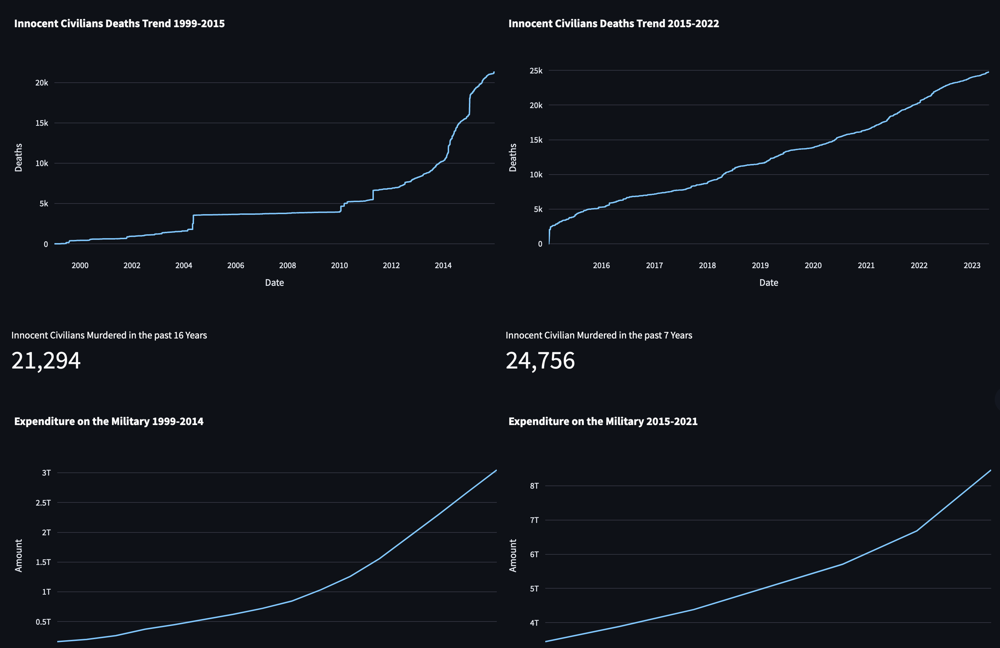
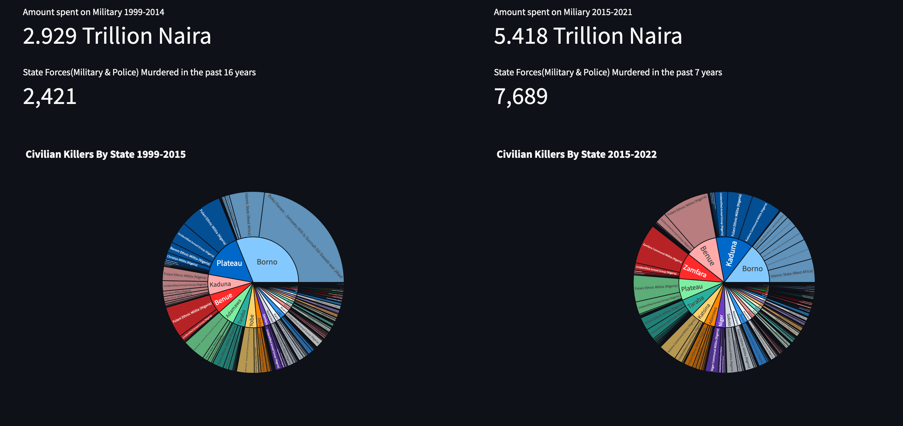
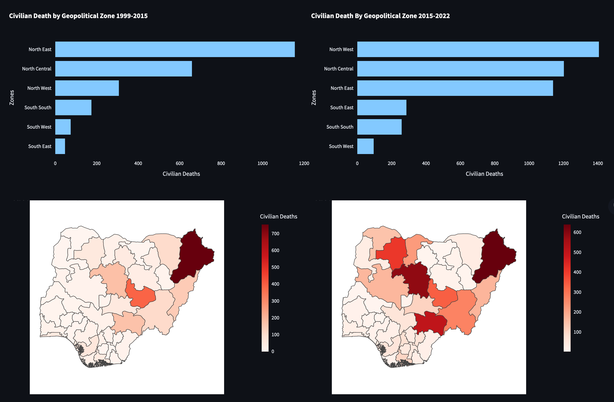

## Armed Conflict Analytics

This project takes an indepth analysis and  exploration of the  Armed Conflcit  with particular 
attention to the senseless killings/murders of innocent civilians in Nigeria.

### Critical Questions
The exploration seeks to answer the following questions:
- Have the  security of life and property of innocent civilians improved  or deteriorated between 1999-2015 and 2015-2022?
  - How many innocent civilians have died between these periods?
  - How many State Forces-military and Police  have died between these periods?

- Who are the  killers of Innocent civilians and state forces?
  - where are these killers located?
  - Does the  sharia status of a state play a role in these kilings?

- How is the security situation from Geo-political perspectives?

We have  tried to  answer these  questions and many more from a  data driven perspective through simple  visualizations.

### How to use
1. `git clone https://github.com/ajakaiye33/conflict-analytics.git`
2. `cd conflict-analytics`
3. `make install`
4. `streamlit run conflict_analytics.py`

